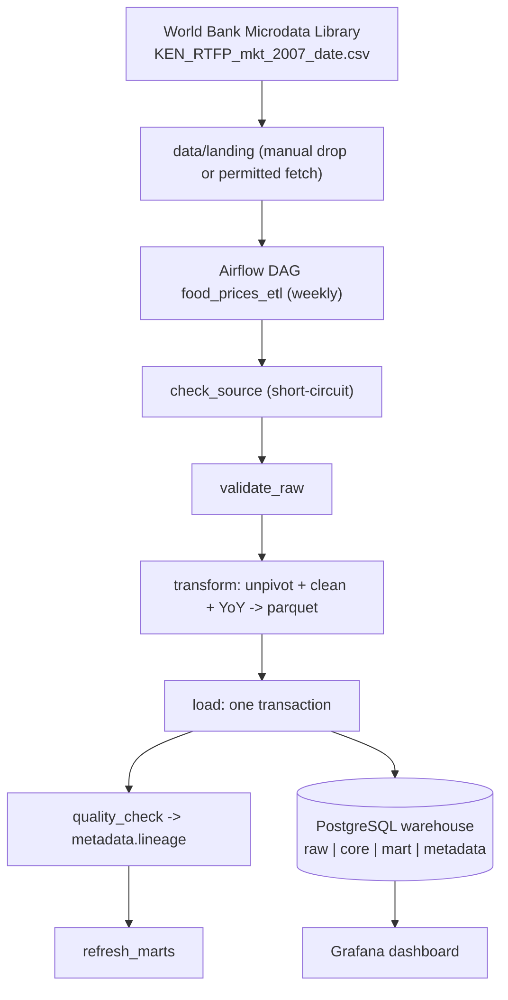

# Architecture

```mermaid
flowchart TD
  src["World Bank Microdata Library<br/>KEN_RTFP_mkt_2007_date.csv"]
  land["data/landing (manual drop or permitted fetch)"]
  dag["Airflow DAG food_prices_etl (weekly)"]
  chk["check_source (short-circuit)"]
  raw["validate_raw"]
  tr["transform: unpivot + clean + YoY -> parquet"]
  ld["load: one transaction"]
  qc["quality_check -> metadata.lineage"]
  mv["refresh_marts"]
  wh[("PostgreSQL warehouse<br/>raw | core | mart | metadata")]
  gf["Grafana dashboard"]
  src --> land --> dag
  dag --> chk --> raw --> tr --> ld --> qc --> mv
  ld --> wh
  wh --> gf
```

Services (docker compose): `airflow-db`, `warehouse-db`, `airflow-init`, `airflow-webserver`, `airflow-scheduler`, `grafana`.
